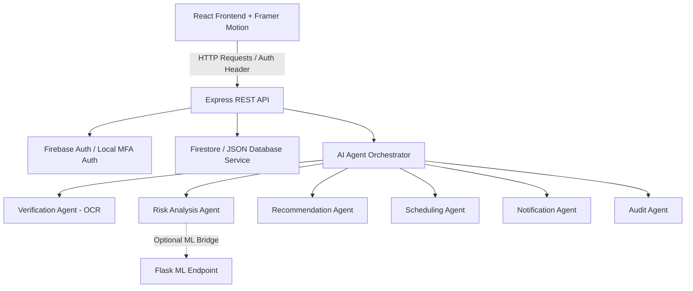

# Architecture Diagram & System Design - SecureGate AI

## 1. High-Level Architecture
SecureGate AI follows a decoupled Client-Server architecture utilizing a modern single-page-application frontend and a robust REST API backend.



---

## 2. Flask ML Integration Layer
The system uses a fallback bridge pattern for risk analysis. The `mlBridge.ts` acts as an adapter layer calling the external Flask ML API `http://localhost:8000/api/ml/analyze`. 
- If the Flask endpoint responds successfully, its data is mapped to the internal risk format.
- If the endpoint times out (5 seconds) or is unavailable, the bridge falls back to the deterministic local `Risk Analysis Agent`. 
This guarantees system stability during Hackathon presentations regardless of the ML team's deployment status.

---

## 2. Database Schema (Firestore / JSON Database Structures)

### Users Collection (`users`)
Keeps track of authentication records and roles for employees, executives, administrators, and visitors.
```json
{
  "uid": "string (Primary Key)",
  "name": "string",
  "email": "string (unique)",
  "mobile": "string",
  "role": "visitor | employee | executive | admin",
  "details": {
    "company": "string (optional)",
    "govIdType": "aadhaar | pan (optional)",
    "govIdNumber": "string (optional)",
    "vehicleNumber": "string (optional)",
    "laptopDetails": "string (optional)",
    "employeeId": "string (optional)",
    "department": "string (optional)",
    "designation": "string (optional)"
  },
  "status": "active | locked | blacklisted",
  "failedAttempts": "number",
  "createdAt": "timestamp"
}
```

### Visitor Requests Collection (`requests`)
Tracks appointments, AI analysis, OCR data, scheduling details, and human approval status.
```json
{
  "id": "string (Primary Key)",
  "visitorId": "string (References users.uid)",
  "visitorName": "string",
  "visitorEmail": "string",
  "visitorMobile": "string",
  "company": "string",
  "photoUrl": "string",
  "govIdUrl": "string",
  "ocrData": {
    "extractedName": "string",
    "extractedId": "string",
    "confidence": "number",
    "documentVerified": "boolean"
  },
  "meetingDetails": {
    "employeeId": "string (References users.uid)",
    "employeeName": "string",
    "department": "string",
    "purpose": "string",
    "scheduledTime": "timestamp",
    "durationMinutes": "number",
    "roomAllocation": "string"
  },
  "aiAnalysis": {
    "riskScore": "low | medium | high",
    "riskReasoning": "string",
    "recommendation": "approve | reject | escalate",
    "confidenceScore": "number",
    "timestamp": "timestamp"
  },
  "status": "pending_verification | pending_approval | approved | rejected | checked_in | checked_out",
  "approvals": {
    "employeeApproved": "boolean | null",
    "employeeNotes": "string",
    "executiveApproved": "boolean | null",
    "adminApproved": "boolean | null"
  },
  "qrToken": "string (JWT)",
  "checkInTime": "timestamp | null",
  "checkOutTime": "timestamp | null",
  "createdAt": "timestamp"
}
```

### Audit Logs Collection (`audit_logs`)
An immutable record of all security-sensitive actions and AI/human decisions.
```json
{
  "id": "string (Primary Key)",
  "timestamp": "timestamp",
  "userId": "string",
  "userEmail": "string",
  "role": "string",
  "action": "string",
  "previousState": "object | null",
  "newState": "object | null",
  "ipAddress": "string",
  "userAgent": "string",
  "aiDecision": "object | null",
  "humanApproval": "boolean | null",
  "status": "success | failure"
}
```

### Configuration Collection (`system_config`)
Allows administrators to tune thresholds and configuration parameters.
```json
{
  "key": "string (Primary Key)",
  "riskThreshold": "number",
  "autoEscalateHighRisk": "boolean",
  "mfaEnabled": "boolean",
  "sessionTimeoutMs": "number",
  "allowedEntryHours": {
    "start": "string",
    "end": "string"
  }
}
```

---

## 3. Custom QR Code Token & Scanning Logic
When a visitor request is fully approved, the backend generates an encrypted JWT token. The payload includes:
- `requestId`: Link to the database entry.
- `visitorId`: Verification link.
- `photoUrl`: Visual confirmation at the gate.
- `exp`: Timestamp of entry expiration (normally the day of the visit).

The Security Gate dashboard decodes the token, displays the visitor details, confirms the check-in status, and signs the check-in time using the private secret key on the backend.
